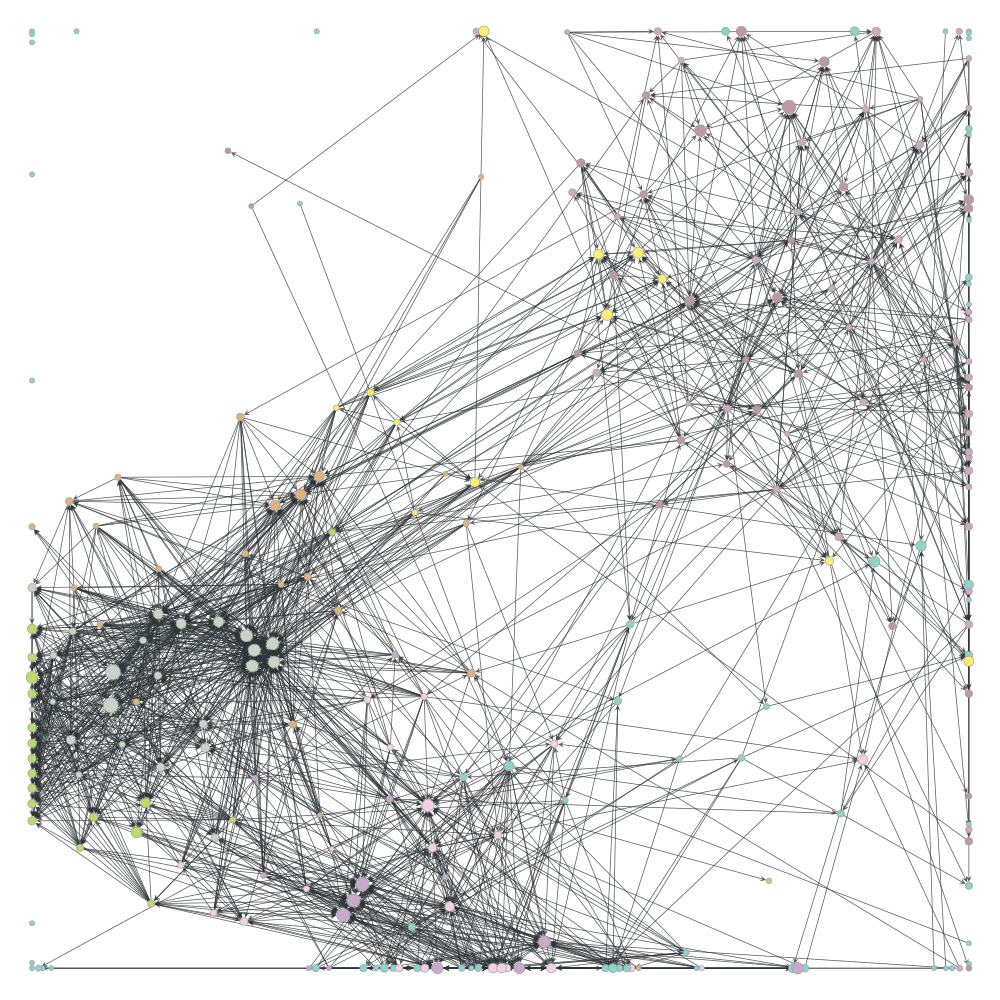
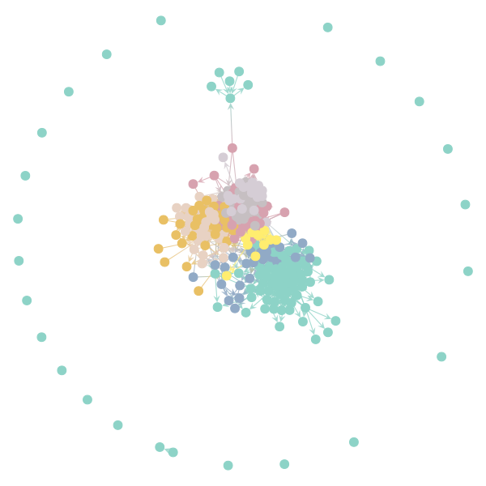

# Use

## Content

* [NLTK-Patents.ipynb](/NLTK-Patents.ipynb): to parse the patents with NLTK.
* [2020: Pandas!](/20180318-Pandas.ipynb): getting the database and parsing it into a df. [Compressed](/AllPatentsStructure.csv.gz).

## Parsing the different patents

Using:

 python us_patents.py

In yellow, the scraped patents, in white, the connected patents, but not scrapped yet. _It's interesting to note that the central patent is common to the three scrapped patents, but was not identified as being relevant for the moment._

## Features

* Getting patents and caching them in a .cache folder
* Save a DB of patents, including backward and forward patents
* Save images of patents

## Plotting graphs

# Changelog

* 2018-05-06: [playing with NLTK](NLTK-Patents.ipynb)
* 2018-04-29: adding [plotting graphs](CreateMD.ipynb)
* 2018-03-18: [get and save patents](20180318-Patents.ipynb)

